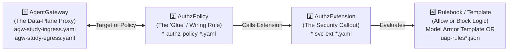

# `cfg/` — Agent Gateway, Service Extensions & UAP Configuration Guide

When you look inside `cfg/`, there are **8 YAML/JSON files** (plus [`cfg/env.sh`](./env.sh)). At first glance, having 8 separate files across 4 different `gcloud` APIs can feel overwhelming.

Once you see the **4-Building-Block Pattern** (which works just like Google Cloud Load Balancing / Secure Web Proxy + Envoy `ext_authz` Service Extensions + Cloud Armor), every single file in `cfg/` becomes easy to read!

---

## 0. The Big Picture: What Do Agent Gateway, `AuthzPolicy`, and `AuthzExtension` Actually Do?

Every Agent Gateway stack in `cfg/` is split into **4 modular building blocks**:



| Building Block | GCP API / Resource Type | Networking Analogy | Files in `cfg/` | What It Actually Does |
| :--- | :--- | :--- | :--- | :--- |
| **1️⃣ `AgentGateway`** | `networkservices.googleapis.com` (`agentGateways`) | **The Proxy Appliance** (Reverse Proxy for Ingress; Forward Secure Web Proxy for Egress) | [`agw-study-ingress.yaml`](./agw-study-ingress.yaml)<br>[`agw-study-egress.yaml`](./agw-study-egress.yaml) | Creates the Google-managed Envoy proxy in the data plane (`CLIENT_TO_AGENT` for inbound traffic; `AGENT_TO_ANYWHERE` for outbound traffic). **By itself, a bare Gateway is just a proxy pipe—it does not block anything until an `AuthzPolicy` is attached to it!** |
| **2️⃣ `AuthzPolicy`** | `networksecurity.googleapis.com` (`authzPolicies`) | **The Wiring Cable / Traffic Hook** connecting the Proxy to an External Security Engine | [`agw-study-ingress-authz-policy-modar.yaml`](./agw-study-ingress-authz-policy-modar.yaml)<br>[`agw-study-egress-authz-policy-iap.yaml`](./agw-study-egress-authz-policy-iap.yaml) | Attaches to a specific `target` (`AgentGateway`) and tells the proxy: *"At stage `CONTENT_AUTHZ` (payload inspection) or `REQUEST_AUTHZ` (identity check), pause the request and call `customProvider.authzExtension`."* |
| **3️⃣ `AuthzExtension`** *(Service Extension)* | `networkservices.googleapis.com` (`authzExtensions`) | **The External Security Brain (`ext_authz` Callout)** | [`agw-study-ingress-svc-ext-modar.yaml`](./agw-study-ingress-svc-ext-modar.yaml)<br>[`agw-study-egress-svc-ext-iap.yaml`](./agw-study-egress-svc-ext-iap.yaml) | Configures **which Google security service** the proxy calls out to over gRPC (`modelarmor.<REGION>.rep.googleapis.com` for Ingress; `iap.googleapis.com` for Egress), what headers/metadata to pass, how long to wait (`timeout`), and whether to **Fail Closed** (`failOpen: false`). |
| **4️⃣ Rulebook / Template** | `modelarmor.googleapis.com` (`templates`) **OR** `iam.googleapis.com` (`accessPolicies`) | **The Firewall Rule Table / IPS Signature Profile** | Model Armor Template (`agw-study-ingress-modar-req-template`)<br>[`uap-rules.json`](./uap-rules.json)<br>[`uap-rules-allow-subnet.json`](./uap-rules-allow-subnet.json) | The actual rules evaluated by the Security Brain:<br>• **Model Armor Template:** Blocks Prompt Injection, Jailbreak, and RAI violations.<br>• **UAP JSON Rules:** Checks the calling agent's **SPIFFE ID** (`principals`) and target **Agent Registry** entry (`conditions`). |

> **Why did the Google Cloud Console UI only ask me to fill out one form when creating a Gateway?**
> When you click **Create Gateway** in the Console UI and toggle **AI Security** or **Access authorization** ON, the UI behind the scenes automatically creates **Building Blocks 1️⃣, 2️⃣, and 3️⃣** (`AgentGateway` + `AuthzPolicy` + `AuthzExtension`) at the same time! Having the YAML files in `cfg/` lets you see and customize fields that the UI wizard hides (such as setting `failOpen: false` and `forwardHeaders: ["authorization"]`).

---

## 0.5 File-by-File Syntax Walkthrough of Every File in `cfg/`

### Part A: The Ingress Agent Gateway Stack (3 YAML Files — North-South Prompt Inspection)

#### File 1: [`cfg/agw-study-ingress.yaml`](./agw-study-ingress.yaml) — *The Inbound Reverse Proxy*
```yaml
name: agw-study-ingress                 # 1. Name of the AgentGateway resource
protocols:
- MCP                                   # 2. Protocol family enabled on the gateway
googleManaged:
  governedAccessPath: CLIENT_TO_AGENT   # 3. Direction: Inbound (Caller -> Target Agent)
```
- **How to read the syntax:**
  - `name: agw-study-ingress`: The resource ID of the gateway in `us-central1`.
  - `protocols: [MCP]`: Required field specifying the agent protocol family handled by the gateway proxy.
  - `googleManaged.governedAccessPath: CLIENT_TO_AGENT`: Tells Google Cloud to provision a **google-managed Reverse Proxy** that sits *in front of* a destination Agent Platform `ReasoningEngine` (protecting `check-gcp-subnet-ips-agw` from incoming callers).

---

#### File 2: [`cfg/agw-study-ingress-svc-ext-modar.yaml`](./agw-study-ingress-svc-ext-modar.yaml) — *The Model Armor Service Extension Callout*
```yaml
name: agw-study-ingress-aisecurity-authzextension   # 1. Extension name (matches UI convention: <gw>-aisecurity-authzextension)
service: modelarmor.us-central1.rep.googleapis.com  # 2. Regional Model Armor gRPC callout endpoint (REP)
forwardHeaders:
- authorization                                     # 3. CRITICAL: Forwards caller's Bearer token to Model Armor!
metadata:
  model_armor_settings: '[                          # 4. Tells Model Armor which template to run on Prompts & Responses
    {
      "request_template_id": "projects/gcp-demo-02-307713/locations/us-central1/templates/agw-study-ingress-modar-req-template",
      "response_template_id": "projects/gcp-demo-02-307713/locations/us-central1/templates/agw-study-ingress-modar-req-template"
    }
  ]'
failOpen: false                                     # 5. Fail Closed: if Model Armor blocks or errors, DENY the request!
timeout: 5s                                         # 6. Max time to wait for Model Armor inspection
```
- **How to read the syntax:**
  - `service: modelarmor.us-central1.rep.googleapis.com`: Points the Envoy `ext_authz` filter to the **Regional Endpoint (REP)** of Model Armor in `us-central1`.
  - `forwardHeaders: ["authorization"]`: Instructs the Agent Gateway proxy to include the HTTP `Authorization: Bearer ...` header when calling Model Armor. *(Without this line—which the Console UI omits by default—Model Armor returns `403/404`!)*
  - `metadata.model_armor_settings`: A JSON string array specifying `request_template_id` (inspects the **incoming user/agent prompt** before it reaches `check-gcp-subnet-ips-agw`) and `response_template_id` (inspects the **outgoing LLM reply** before it goes back to the caller).
  - `failOpen: false`: **Fail-Closed enforcement.** When the Console UI creates this extension, it defaults to `failOpen: true` (which allows requests through if an error occurs). Setting `failOpen: false` guarantees strict blocking.

---

#### File 3: [`cfg/agw-study-ingress-authz-policy-modar.yaml`](./agw-study-ingress-authz-policy-modar.yaml) — *The Wiring Policy Connecting Ingress Gateway $\rightarrow$ Model Armor Extension*
```yaml
name: agw-study-ingress-aisecurity-authzpolicy      # 1. Policy name (matches UI convention: <gw>-aisecurity-authzpolicy)
target:
  resources:
  - "projects/gcp-demo-02-307713/locations/us-central1/agentGateways/agw-study-ingress"  # 2. WHICH Gateway to attach to
policyProfile: CONTENT_AUTHZ                        # 3. Inspection stage: Layer-7 Body/Payload Inspection (Prompts & Responses)
action: CUSTOM                                      # 4. Delegate decision to an external Service Extension
customProvider:
  authzExtension:
    resources:
    - "projects/gcp-demo-02-307713/locations/us-central1/authzExtensions/agw-study-ingress-aisecurity-authzextension" # 5. WHICH Extension to call
```
- **How to read the syntax:**
  - `target.resources`: Points to **File 1** (`agw-study-ingress`).
  - `policyProfile: CONTENT_AUTHZ`: Tells the gateway proxy to buffer and send the **HTTP request body (the prompt)** and **HTTP response body (the LLM output)** to the extension. (Compare this with `REQUEST_AUTHZ` in Egress below, which only sends request headers/identity metadata!)
  - `action: CUSTOM` + `customProvider.authzExtension.resources`: Points to **File 2** (`agw-study-ingress-aisecurity-authzextension`).

---

### Part B: The Egress Agent Gateway Stack (3 YAML Files + 2 JSON UAP Files — East-West Zero-Trust Identity)

#### File 4: [`cfg/agw-study-egress.yaml`](./agw-study-egress.yaml) — *The Outbound Forward Proxy*
```yaml
name: agw-study-egress                  # 1. Name of the Egress AgentGateway resource
protocols:
- MCP                                   # 2. Protocol family
googleManaged:
  governedAccessPath: AGENT_TO_ANYWHERE # 3. Direction: Outbound (Calling Agent -> Any Destination)
registries:                             # 4. Agent Registries used to identify outbound destination URLs
- "//agentregistry.googleapis.com/projects/gcp-demo-02-307713/locations/us-central1"
- "//agentregistry.googleapis.com/projects/gcp-demo-02-307713/locations/global"
```
- **How to read the syntax:**
  - `googleManaged.governedAccessPath: AGENT_TO_ANYWHERE`: Tells Google Cloud to provision a **google-managed Forward Proxy** (Secure Web Proxy under the hood) that intercepts **100% of outbound traffic** leaving a calling agent (`network-agent-agw`).
  - `registries`: Links the Egress Gateway to your regional (`us-central1`) and `global` **Agent Registries**. Why? Because when `network-agent-agw` makes an outbound HTTPS call to a URL (like `https://us-central1-aiplatform.googleapis.com/.../reasoningEngines/1020302260355203072:streamQuery`), the Egress Gateway looks up that URL in `registries` to resolve which **Agent Registry resource** (`destination.agent_registry.agent.name` or `endpoint.name`) is being called!

---

#### File 5: [`cfg/agw-study-egress-svc-ext-iap.yaml`](./agw-study-egress-svc-ext-iap.yaml) — *The IAP v2 Service Extension Callout*
```yaml
name: agw-study-egress-iap-authzextension  # 1. Extension name (matches UI convention: <gw>-iap-authzextension)
service: iap.googleapis.com                # 2. Global Identity-Aware Proxy (IAP) gRPC callout service
failOpen: false                            # 3. Fail Closed (`Enforce` mode in UI; `failOpen: true` = `Audit only` in UI)
timeout: 1s                                # 4. Max time to wait for IAP policy check
metadata:
  iapPolicyVersion: "V2"                   # 5. Selects Unified Access Policy (UAP = "V2") instead of legacy IAM Allow ("V1")
```
- **How to read the syntax:**
  - `service: iap.googleapis.com`: Points the Egress Gateway's authorization callout to **Google Cloud Identity-Aware Proxy (IAP)**.
  - `failOpen: false`: Enforces **Zero-Trust Default Deny** (`Enforce` mode in the Console UI). If you switch the Console UI to `Audit only`, the UI changes this line to `failOpen: true`.
  - `metadata.iapPolicyVersion: "V2"`: Tells IAP to evaluate **Unified Access Policies (UAP)** (`gcloud iam access-policies`, where you can write fine-grained CEL rules per target agent/endpoint) instead of legacy project-wide IAM Allow (`"V1"`).

---

#### File 6: [`cfg/agw-study-egress-authz-policy-iap.yaml`](./agw-study-egress-authz-policy-iap.yaml) — *The Wiring Policy Connecting Egress Gateway $\rightarrow$ IAP Extension*
```yaml
name: agw-study-egress-iap-authzpolicy     # 1. Policy name (matches UI convention: <gw>-iap-authzpolicy)
target:
  resources:
  - "projects/gcp-demo-02-307713/locations/us-central1/agentGateways/agw-study-egress" # 2. Attach to Egress Gateway
policyProfile: REQUEST_AUTHZ               # 3. Inspection stage: Request-level Identity & Destination Authorization
action: CUSTOM                             # 4. Delegate decision to an external Service Extension
customProvider:
  authzExtension:
    resources:
    - "projects/gcp-demo-02-307713/locations/us-central1/authzExtensions/agw-study-egress-iap-authzextension" # 5. Call IAP Extension
```
- **How to read the syntax:**
  - `target.resources`: Points to **File 4** (`agw-study-egress`).
  - `policyProfile: REQUEST_AUTHZ`: Unlike `CONTENT_AUTHZ` (which inspects prompt text), `REQUEST_AUTHZ` runs at the **connection/request header stage** to check: *"Is this caller identity (`principal`) allowed to connect to this destination URL?"*
  - `customProvider.authzExtension.resources`: Points to **File 5** (`agw-study-egress-iap-authzextension`).

---

#### Files 7 & 8: [`cfg/uap-rules.json`](./uap-rules.json) (Before Rule 2) & [`cfg/uap-rules-allow-subnet.json`](./uap-rules-allow-subnet.json) (After Rule 2) — *The Zero-Trust Access Rules Evaluated by IAP v2*
```json
[
  {
    "description": "Rule 1: Allow Agent Platform runtimes in project 66063681189 to reach Core Google APIs (agentregistry-00000000-0000-0000-444f-0dd5654527c5)",
    "effect": "ALLOW",
    "principals": [
      "principalSet://agents.global.org-304553879287.system.id.goog/attribute.platformContainer/aiplatform/projects/66063681189"
    ],
    "operation": {
      "permissions": [
        "iap.googleapis.com/resources.egressViaIAP"
      ]
    },
    "conditions": {
      "iap.googleapis.com": {
        "expression": "destination.is_registered == true && destination.agent_registry.resource_type == 'ENDPOINT' && (destination.agent_registry.endpoint.name == 'projects/gcp-demo-02-307713/locations/us-central1/endpoints/core-gapi-services' || destination.agent_registry.endpoint.name == 'projects/gcp-demo-02-307713/locations/us-central1/endpoints/agentregistry-00000000-0000-0000-444f-0dd5654527c5' || destination.agent_registry.endpoint.name == 'projects/66063681189/locations/us-central1/endpoints/agentregistry-00000000-0000-0000-444f-0dd5654527c5')"
      }
    }
  },
  {
    "description": "Rule 2: Allow ONLY network-agent-agw (1179054147220013056) SPIFFE ID to call check-gcp-subnet-ips-agw",
    "effect": "ALLOW",
    "principals": [
      "principal://agents.global.org-304553879287.system.id.goog/resources/aiplatform/projects/66063681189/locations/us-central1/reasoningEngines/1179054147220013056"
    ],
    "operation": {
      "permissions": [
        "iap.googleapis.com/resources.egressViaIAP"
      ]
    },
    "conditions": {
      "iap.googleapis.com": {
        "expression": "destination.is_registered == true && destination.agent_registry.resource_type == 'AGENT' && (destination.agent_registry.agent.name == 'projects/gcp-demo-02-307713/locations/us-central1/agents/check-gcp-subnet-ips-agw' || destination.agent_registry.agent.name == 'projects/gcp-demo-02-307713/locations/us-central1/agents/agentregistry-00000000-0000-0000-f25b-29d92d70d0d5' || destination.agent_registry.agent.name == 'projects/66063681189/locations/us-central1/agents/agentregistry-00000000-0000-0000-f25b-29d92d70d0d5')"
      }
    }
  }
]
```
- **How to read the syntax of each UAP Rule (`WHO` + `WHAT PERMISSION` + `WHICH DESTINATION`):**
  1. **`"description"`**: Human-readable label for the rule (must be **$\le$ 256 characters**).
  2. **`"effect": "ALLOW"`**: Since Egress Agent Gateway with IAP v2 is **Default Deny**, rules grant explicit `ALLOW` exceptions.
  3. **`"principals"` (*WHO is calling* — Source Identity):**
     - In **Rule 1**, `"principalSet://.../attribute.platformContainer/aiplatform/projects/66063681189"` matches **all Agent Engine runtimes in project `66063681189`** (so every agent in your project is allowed to call Vertex AI Gemini, Cloud Logging, and Telemetry).
     - In **Rule 2** (only present in `uap-rules-allow-subnet.json`), `"principal://.../reasoningEngines/1179054147220013056"` matches **ONLY `network-agent-agw`'s unique cryptographic SPIFFE identity**! No other agent in the project matches this principal.
  4. **`"operation": {"permissions": ["iap.googleapis.com/resources.egressViaIAP"]}` (*WHAT action*):**
     - The permission checked by the Egress Agent Gateway's IAP v2 extension whenever an agent makes an outbound connection.
  5. **`"conditions": {"iap.googleapis.com": {"expression": "..."}}` (*WHERE they are calling* — Destination in Agent Registry):**
     - A Common Expression Language (**CEL**) rule evaluated by IAP v2 against the Agent Registry lookup:
       - `destination.is_registered == true`: The target URL must be registered in Agent Registry.
       - `destination.agent_registry.resource_type == 'ENDPOINT'` (Rule 1) or `'AGENT'` (Rule 2): Distinguishes between a registered service endpoint (`core-gapi-services`) and a registered agent (`check-gcp-subnet-ips-agw`).
       - `destination.agent_registry.agent.name == '...'`: Matches the specific Agent Registry resource ID (`agentregistry-...` UUID) of `check-gcp-subnet-ips-agw`.

---

## 1. Two Ways to Update `cfg/` When Re-Deploying

### Option A: Automatic Discovery via `gcloud` (`--auto-discover`)
After you set your new `PROJECT_ID` and `REGION` in [`cfg/env.sh`](./env.sh) (and after you register your services/agents), run:
```bash
./render_configs.sh --auto-discover
```
`render_configs.sh --auto-discover` automatically queries GCP via `gcloud` to look up your:
- `PROJECT_NUMBER`
- `ORG_ID`
- `SUBNET_ENGINE_ID` (`check-gcp-subnet-ips-agw` ReasoningEngine ID)
- `NETWORK_ENGINE_ID` (`network-agent-agw` ReasoningEngine ID)
- `CORE_GAPI_ENDPOINT_ID` (`agentregistry-...` UUID for `core-gapi-services`)
- `SUBNET_AGENT_AUTO_REG_ID` (`agentregistry-...` UUID for auto-discovered `check-gcp-subnet-ips-agw`)
- `SUBNET_AGENT_CUSTOM_REG_ID` (`agentregistry-...` UUID for custom `.mtls.` service `check-gcp-subnet-ips-agw`)

and re-writes all 8 `.yaml` and `.json` files in `cfg/`!

### Option B: Manual Edit in [`cfg/env.sh`](./env.sh)
Open [`cfg/env.sh`](./env.sh), update the variables with your new values, and run:
```bash
./render_configs.sh
```

---

## 2. Complete Checklist of Variables (Including "Hidden" Static Values!)

| Variable Name in [`cfg/env.sh`](./env.sh) | Description & Why It Changes | Example Value | How to Find It (`gcloud` Command) | Files Where It Is Used |
| :--- | :--- | :--- | :--- | :--- |
| **`PROJECT_ID`** | Your GCP Project ID string. | `"gcp-demo-02-307713"` | `gcloud config get-value project` | `agw-study-egress.yaml`, `agw-study-egress-authz-policy-iap.yaml`, `agw-study-ingress-svc-ext-modar.yaml`, `agw-study-ingress-authz-policy-modar.yaml`, `uap-rules*.json` |
| **`PROJECT_NUMBER`** | Your numeric GCP Project Number. Used in `ReasoningEngine` resource names, SPIFFE IDs, UAP CEL rules, and P4SA service account emails. | `"66063681189"` | `gcloud projects describe $PROJECT_ID --format="value(projectNumber)"` | `uap-rules.json`, `uap-rules-allow-subnet.json`, `network_agent/agent.py` |
| **`ORG_ID`** *(Hidden in SPIFFE URIs!)* | Your numeric GCP Organization ID. Every Agent Platform SPIFFE identity begins with `principal://agents.global.org-<ORG_ID>.system.id.goog/...`. If you move to a project in a different Org, this changes! | `"304553879287"` | `gcloud projects get-ancestors $PROJECT_ID --format="value(id)" \| tail -n 1` | `uap-rules.json`, `uap-rules-allow-subnet.json` |
| **`REGION`** *(Hidden in Model Armor REP hostname!)* | Region for Agent Gateway, Model Armor, Agent Registry, and Agent Platform. Must support both `agentGateways` and `modelarmor`. Also changes the **Regional Endpoint (REP) hostname** in `agw-study-ingress-svc-ext-modar.yaml` (`service: modelarmor.<REGION>.rep.googleapis.com`). | `"us-central1"` or `"asia-southeast1"` | N/A (choose a supported region) | All `cfg/*.yaml`, `uap-rules*.json`, `network_agent/agent.py` |
| **`CLOUD_RUN_REGION`** | Region for Cloud Run services (Mode 1 & Mode 3 Web UI). Can be `asia-southeast2` even when Agent Gateway is in `us-central1`. | `"asia-southeast2"` | N/A | `network_agent/agent.py`, `cfg/env.sh` |
| **`SUBNET_ENGINE_ID`** | Random numeric `ReasoningEngine` ID generated when you deploy `check-gcp-subnet-ips-agw` to Agent Platform. | `"1020302260355203072"` | `./render_configs.sh --auto-discover` *(queries Vertex AI `reasoningEngines` REST API newest-first)* | `cfg/env.sh`, `network_agent/agent.py` |
| **`NETWORK_ENGINE_ID`** | Random numeric `ReasoningEngine` ID generated when you deploy `network-agent-agw` to Agent Platform. Used in the SPIFFE principal of UAP Rule 2. | `"1179054147220013056"` | `./render_configs.sh --auto-discover` *(queries Vertex AI `reasoningEngines` REST API newest-first)* | `cfg/env.sh`, `uap-rules-allow-subnet.json` (Rule 2 `principals`) |
| **`CORE_GAPI_ENDPOINT_ID`** *(Hidden Agent Registry UUID!)* | Random `agentregistry-...` UUID generated when you register `core-gapi-services` in Agent Registry. IAP v2 checks this internal UUID in UAP Rule 1! | `"agentregistry-00000000-0000-0000-444f-0dd5654527c5"` | `gcloud alpha agent-registry services describe core-gapi-services --location=$REGION --project=$PROJECT_ID --format="value(registryResource)" \| awk -F'/' '{print $NF}'` | `uap-rules.json`, `uap-rules-allow-subnet.json` (Rule 1 CEL `expression`) |
| **`SUBNET_AGENT_AUTO_REG_ID`** *(Hidden Agent Registry UUID!)* | Random `agentregistry-...` UUID auto-created in Agent Registry when `check-gcp-subnet-ips-agw` is deployed on Agent Platform. | `"agentregistry-00000000-0000-0000-bf2d-ca1285f7103b"` | `gcloud alpha agent-registry agents list --location=$REGION --project=$PROJECT_ID --filter="displayName=check-gcp-subnet-ips-agw" --format="value(name)" \| head -n 1 \| awk -F'/' '{print $NF}'` | `uap-rules-allow-subnet.json` (Rule 2 CEL `expression`) |
| **`SUBNET_AGENT_CUSTOM_REG_ID`** *(Hidden Agent Registry UUID!)* | Random `agentregistry-...` UUID generated when you register the custom `.mtls.` service `check-gcp-subnet-ips-agw` in Agent Registry. | `"agentregistry-00000000-0000-0000-f25b-29d92d70d0d5"` | `gcloud alpha agent-registry services describe check-gcp-subnet-ips-agw --location=$REGION --project=$PROJECT_ID --format="value(registryResource)" \| awk -F'/' '{print $NF}'` | `uap-rules-allow-subnet.json` (Rule 2 CEL `expression`) |

---

## 3. Non-File IAM Bindings That Also Use `PROJECT_NUMBER` When Moving to a New Project

When you switch to a new GCP project, remember that two Google-managed Service Agents (P4SAs) in the new project include your new **`PROJECT_NUMBER`** in their email addresses and require IAM bindings:

1. **Service Extensions P4SA (`service-${PROJECT_NUMBER}@gcp-sa-dep.iam.gserviceaccount.com`):**
   Must have `roles/modelarmor.user` so the Ingress Agent Gateway can invoke Model Armor templates:
   ```bash
   source cfg/env.sh
   gcloud projects add-iam-policy-binding "${PROJECT_ID}" \
     --member="serviceAccount:service-${PROJECT_NUMBER}@gcp-sa-dep.iam.gserviceaccount.com" \
     --role="roles/modelarmor.user"
   ```
2. **Vertex AI Reasoning Engine P4SA (`service-${PROJECT_NUMBER}@gcp-sa-aiplatform-re.iam.gserviceaccount.com`):**
   Must have `roles/aiplatform.user` so one Agent Engine runtime can call `:streamQuery` on another Agent Engine runtime:
   ```bash
   source cfg/env.sh
   gcloud projects add-iam-policy-binding "${PROJECT_ID}" \
     --member="serviceAccount:service-${PROJECT_NUMBER}@gcp-sa-aiplatform-re.iam.gserviceaccount.com" \
     --role="roles/aiplatform.user"
   ```
